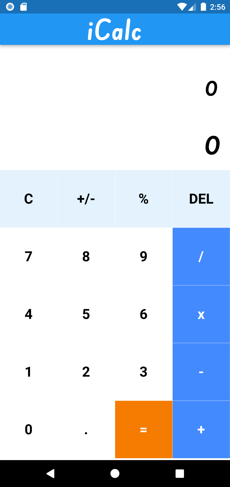
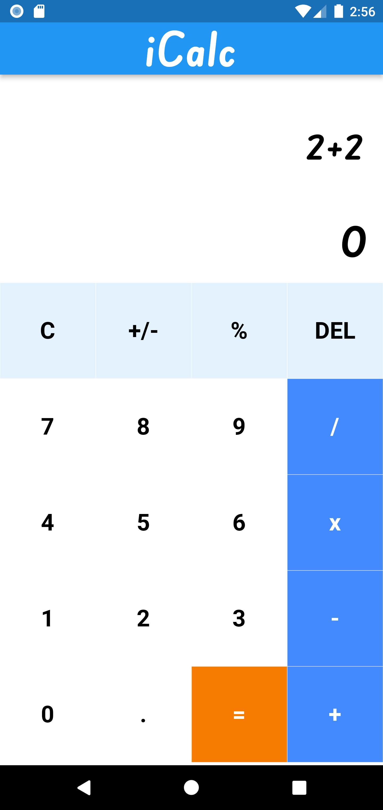
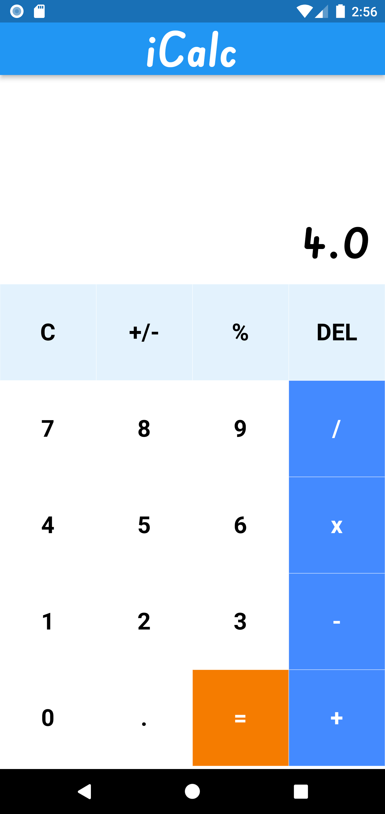

## iCalc - Personal Calculator

### iCalc is a personal calculator used to perform basic mathematical calculations

## Screenshots

<table>
            <tr>
                <td>
                    
                </td>

<td>
                    
                </td>
        <td>
        
        </td>
    </tr>
</table>

## Deployment

### Yet to be release